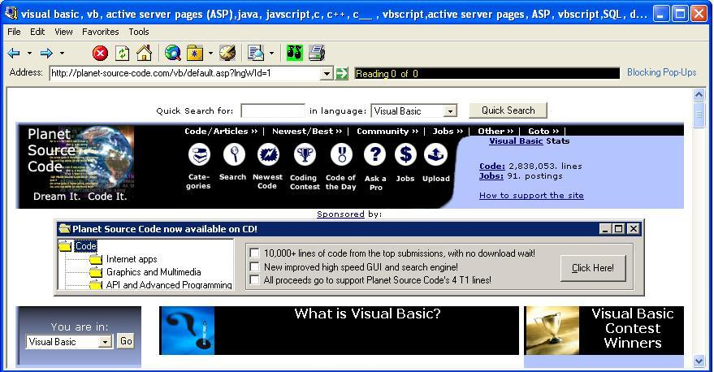



## A Web Browser with ALL of the trimmings

### Description

This browser has practically every feature that IE has. History, favorites etc. It is almost a clone. Almost everything that I have learned about VB I have learned here, THANKS! I would appreciate any helpful feedback you have to offer.
 
### More Info
 

             |
---                |---
**Submitted On**   |2003-03-24 07:29:16
**By**             |[Steve Trout](https://github.com/Planet-Source-Code/PSCIndex/blob/master/ByAuthor/steve-trout.md)
**Level**          |Beginner
**User Rating**    |4.8 (53 globes from 11 users)
**Compatibility**  |VB 6\.0
**Category**       |[Internet/ HTML](https://github.com/Planet-Source-Code/PSCIndex/blob/master/ByCategory/internet-html__1-34.md)
**World**          |[Visual Basic](https://github.com/Planet-Source-Code/PSCIndex/blob/master/ByWorld/visual-basic.md)
**Archive File**   |[A\_Web\_Brow1565533282003\.zip](https://github.com/Planet-Source-Code/steve-trout-a-web-browser-with-all-of-the-trimmings__1-44316/archive/master.zip)

